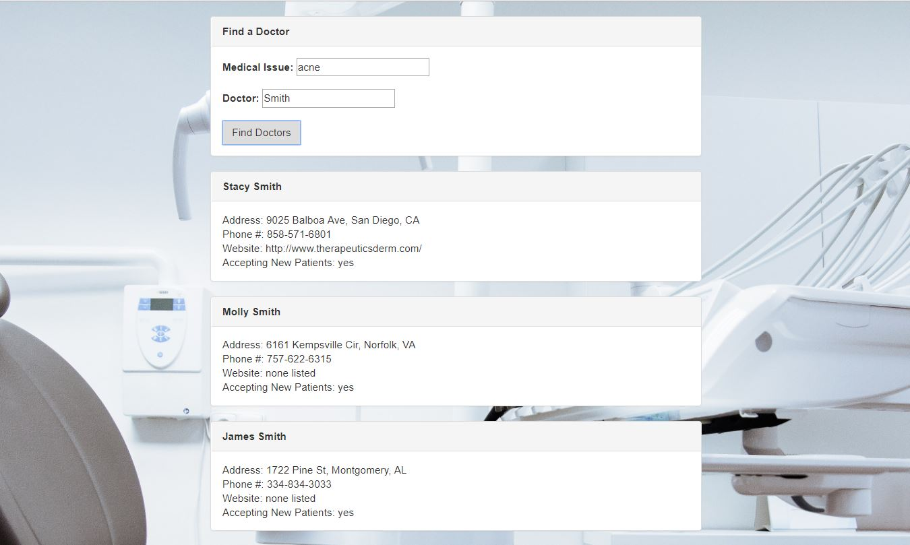

# Doc Finder

#### Doc Finder, Sept 2017

#### By Trevor Gill

## Description
_An application for finding doctors based on a search by name and/or health issue. Uses data from the Better Doctor API project._

## Setup/Installation Requirements
* Clone the repo
* Build gulfile.js
* Open index.html in your preferred browser to launch the application

## Specifications
| Behavior      | Input      | Output       |
| ------------- | ---------- | ------------ |
| The application shall be able to take a given doctor name from input and return a list of doctors with that name | Doctor Name: "Smith" | ["Stacy Smith", "Molly Smith"...] |
| The application shall be able to take a given symptom from input and return a list of doctors who reference that keyword in their biography | Symptom: "acne" | ["Stacy Smith", "Molly Smith"...] |
| The application shall be able to display an address, phone number, website, and whether or not new patients are accepted for each doctor returned from the user's query | "Stacy Smith" | address: 9025 Balboa Ave, San Diego, CA, phone number: 858-571-6801, website: http://www.therapeuticsderm.com/, accepting new patients: yes |

# Screenshot

# Known Bugs
_Life expectancy data for a few of the countries in the picklist might not be retrievable via api.population.io._

# Potential Future Improvements
* add ability to search by specific zip
* add pictures of doctors of results panels
* build a map of with pins for each doctor's location

## Technologies Used
* javascript
* jQuery
* atom
* node
* gulp
* Better Doctor API

### License
Copyright &copy; 2017 Trevor Gill
